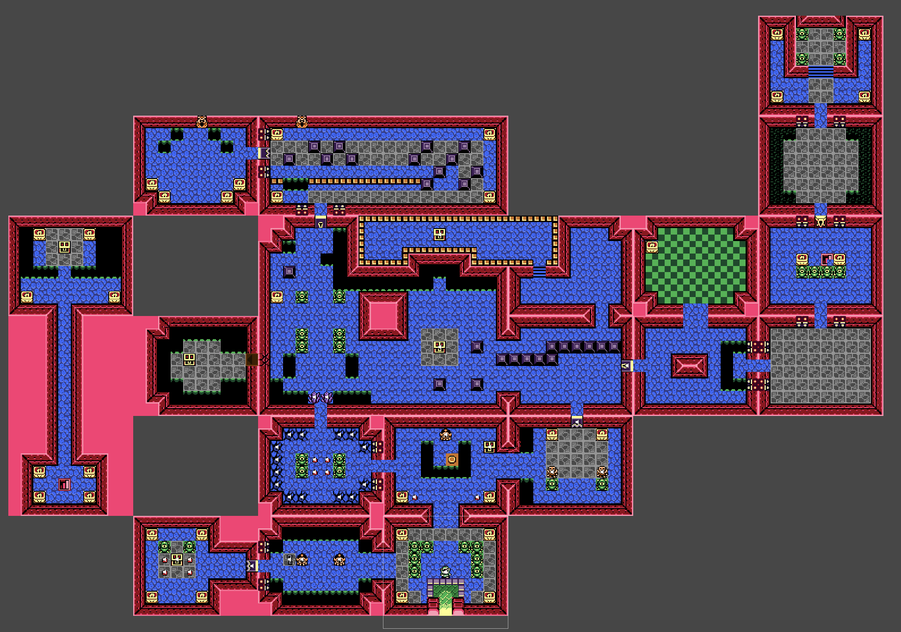
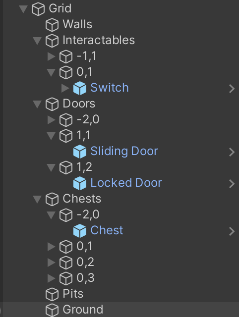

# Contributions

## Alex

Managing all the different types of objects and enemies was a big technical challenge. Creating a [unified `Enemy` class](Assets/Scripts/Enemies/Enemy.cs) allowed everyone in the group to quickly create new enemies that could be managed in bulk by other objects, and for othe rmembers to quickly add features to `Enemy.cs` that all enemies would then be able to use. I replicated the pattern with ["conditionals"](Assets/Scripts/Conditionals/Conditional.cs) and ["interactables"](Assets/Scripts/Interactables/Interactable.cs) that inherited a lot of information, which allowed us to keep the code short and readable, important when you're dealing with so many objects.

The biggest asset I created is the map. It's an accurate re-cration of the dungeon, complete with different layered tilemaps. I made multiple different palette sheets using the official color values for reference and compared them with the original to make sure they looked accurate. The original tilemap was just one layer, but as development progressed, I split it up between multiple layers, walls, floors, holes, conditional items, doors, switches, etc, all linekd with triggers and composite colliders. I also managed to bring in animated tiles for effect.

The biggest code feature I wrote is the room management system. The [main script](Assets/Scripts/Utilities/Room.cs) is hooked into every Conditional and Enemy and activates, deactivates, spawns and despawns everything to keep things cohesive. Rooms also point to other rooms to keep state management clean and update the player's location. Rooms are automatically updated and (de)activated when the [camera manager](Assets/Scripts/Utilities/CameraMovement.cs) detects the player has moved enough distance to be in the next room.

