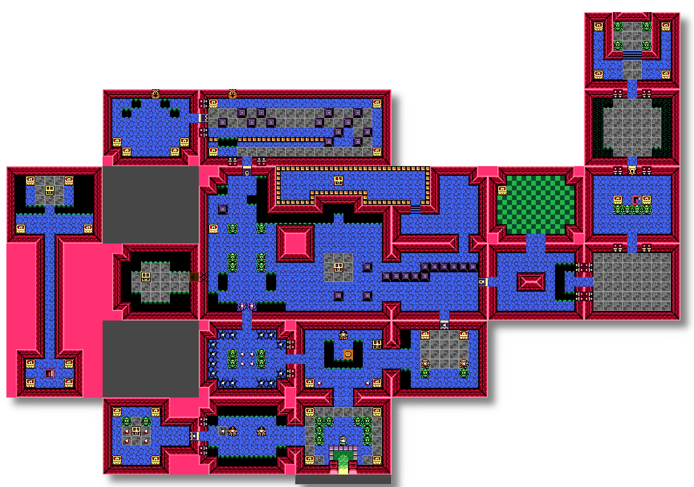
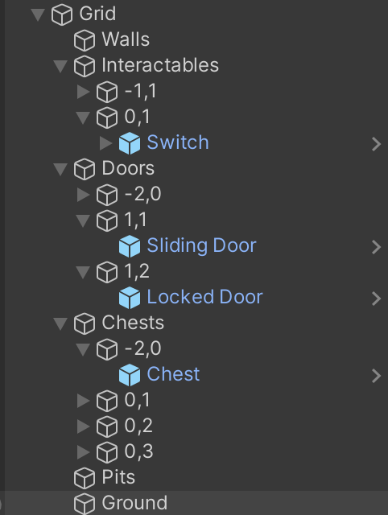

# Contributions

## Alex

Managing all the different types of objects and enemies was a big technical challenge. Creating a [unified `Enemy` class](Assets/Scripts/Enemies/Enemy.cs) allowed everyone in the group to quickly create new enemies that could be managed in bulk by other objects, (for example, with a `List<Enemy>`) and for everyone in the group to quickly add features to `Enemy.cs` that all enemies would then be able to use right away. I replicated this pattern with ["conditionals"](Assets/Scripts/Conditionals/Conditional.cs) and ["interactables"](Assets/Scripts/Interactables/Interactable.cs), which both rely strongly on class inheritance, allowing us to keep the code short and readable, important when we're dealing with so many objects.

The biggest asset I created is the map. It's an accurate re-creation of the dungeon, complete with multiple different layered tilemaps. I made multiple different palette sheets using the official color values for reference and compared them with the original game to make sure they looked accurate. Originally, this tilemap was just one layer, but, as development progressed, I split it up between multiple layers: walls, floors, holes, conditional items, doors, switches, etc, all linked with triggers and composite colliders. I also managed to bring in animated tiles for effect.

The biggest code feature I wrote is probably the room management system. The [main script](Assets/Scripts/Utilities/Room.cs) is hooked into every `Conditional` and `Enemy` and activates, deactivates, spawns, despawns and manages everything from enemies to pickups to items to doors. Keeping everything managed by this system lets us keep things cohesive and easy to read without too many checks in other scripts, and allows us to simply manage state. Rooms also point to other rooms to keep state management clean, and update the player's location, too. Rooms are automatically updated and (de)activated when the [camera manager](Assets/Scripts/Utilities/CameraMovement.cs) detects the player has moved enough distance to be in the next room.

## Reef

See [Reef.md](Contributions/Reef.md)

## Charlee

https://docs.google.com/document/d/1thCoqbr4m7-8qMb27li4CrqWhA272bnmJdNi3AmtYyk/edit?usp=sharing
