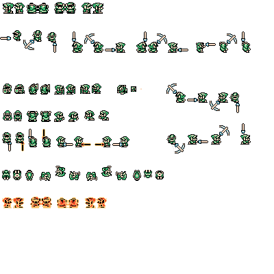

# Contributions

## Alex

Managing all the different types of objects and enemies was a big technical challenge. Creating a [unified `Enemy` class](Assets/Scripts/Enemies/Enemy.cs) allowed everyone in the group to quickly create new enemies that could be managed in bulk by other objects, (for example, with a `List<Enemy>`) and for everyone in the group to quickly add features to `Enemy.cs` that all enemies would then be able to use right away. I replicated this pattern with ["conditionals"](Assets/Scripts/Conditionals/Conditional.cs) and ["interactables"](Assets/Scripts/Interactables/Interactable.cs), which both rely strongly on class inheritance, allowing us to keep the code short and readable, important when we're dealing with so many objects.

The biggest asset I created is the map. It's an accurate re-creation of the dungeon, complete with multiple different layered tilemaps. I made multiple different palette sheets using the official color values for reference and compared them with the original game to make sure they looked accurate. Originally, this tilemap was just one layer, but, as development progressed, I split it up between multiple layers: walls, floors, holes, conditional items, doors, switches, etc, all linked with triggers and composite colliders. I also managed to bring in animated tiles for effect.

The biggest code feature I wrote is probably the room management system. The [main script](Assets/Scripts/Utilities/Room.cs) is hooked into every `Conditional` and `Enemy` and activates, deactivates, spawns, despawns and manages everything from enemies to pickups to items to doors. Keeping everything managed by this system lets us keep things cohesive and easy to read without too many checks in other scripts, and allows us to simply manage state. Rooms also point to other rooms to keep state management clean, and update the player's location, too. Rooms are automatically updated and (de)activated when the [camera manager](Assets/Scripts/Utilities/CameraMovement.cs) detects the player has moved enough distance to be in the next room.

## Reef

The biggest technical challenge was definately managing the link's attack function. This feature is so full in incricuite details that make the hit feel satisfying. This is partly due to the three windows of hit that the player goes through. Starting with the initial slash, followed by link holding his sword out and finishing with the max charge that spins if you let go of the key. In the game there are very specific time windows that change what happens when you let go of the key or keep the key held down. These were pretty confusing to track. In the end, we had to make multiple timers to keep track of different things within the hit function.

The biggest asset contribution i have is the player sprite and animation. I broke down each of links frames, frame by frame by taking screenshots of link in an emulator running at 1 frame per second to make sure that each animation frame was accounted for to ensure that link looked like he was smooth in his transitions. However, i found that this was an ongoing thing because as things and new features would be implemented, i would discover new sprite needs and so this document was constantly updated.

The largest code feature that i wrote was the players movement/shield/jump/attack/fall. these scripts allow link to do his actions in the game such as combat, and room navigation. After the re-factor, these were split into different CS files and were made to talk to each other so they all knew which state link was in. All these are under [the Player script](Assets/Scripts/Player/Player.cs).
