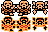

# Contributions

## Alex

Managing all the different types of objects and enemies was a big technical challenge. Creating a [unified `Enemy` class](Assets/Scripts/Enemies/Enemy.cs) allowed everyone in the group to quickly create new enemies that could be managed in bulk by other objects, (for example, with a `List<Enemy>`) and for everyone in the group to quickly add features to `Enemy.cs` that all enemies would then be able to use right away. I replicated this pattern with ["conditionals"](Assets/Scripts/Conditionals/Conditional.cs) and ["interactables"](Assets/Scripts/Interactables/Interactable.cs), which both rely strongly on class inheritance, allowing us to keep the code short and readable, important when we're dealing with so many objects.

The biggest asset I created is the map. It's an accurate re-creation of the dungeon, complete with multiple different layered tilemaps. I made multiple different palette sheets using the official color values for reference and compared them with the original game to make sure they looked accurate. Originally, this tilemap was just one layer, but, as development progressed, I split it up between multiple layers: walls, floors, holes, conditional items, doors, switches, etc, all linked with triggers and composite colliders. I also managed to bring in animated tiles for effect.

The biggest code feature I wrote is probably the room management system. The [main script](Assets/Scripts/Utilities/Room.cs) is hooked into every `Conditional` and `Enemy` and activates, deactivates, spawns, despawns and manages everything from enemies to pickups to items to doors. Keeping everything managed by this system lets us keep things cohesive and easy to read without too many checks in other scripts, and allows us to simply manage state. Rooms also point to other rooms to keep state management clean, and update the player's location, too. Rooms are automatically updated and (de)activated when the [camera manager](Assets/Scripts/Utilities/CameraMovement.cs) detects the player has moved enough distance to be in the next room.

## Reef

The biggest technical challenge was definately managing the link's attack function. This feature is so full in incricuite details that make the hit feel satisfying. This is partly due to the three windows of hit that the player goes through. Starting with the initial slash, followed by link holding his sword out and finishing with the max charge that spins if you let go of the key. In the game there are very specific time windows that change what happens when you let go of the key or keep the key held down. These were pretty confusing to track. In the end, we had to make multiple timers to keep track of different things within the hit function.

The biggest asset contribution I have is the player sprite and animation. I broke down each of links frames, frame by frame by taking screenshots of link in an emulator running at 1 frame per second to make sure that each animation frame was accounted for to ensure that link looked like he was smooth in his transitions. However, i found that this was an ongoing thing because as things and new features would be implemented, i would discover new sprite needs and so this document was constantly updated.

The largest code feature that i wrote was the players movement/shield/jump/attack/fall. these scripts allow link to do his actions in the game such as combat, and room navigation. After the re-factor, these were split into different CS files and were made to talk to each other so they all knew which state link was in. All these are under [the Player script](Assets/Scripts/Player/Player.cs).

## Charlee

https://docs.google.com/document/d/1thCoqbr4m7-8qMb27li4CrqWhA272bnmJdNi3AmtYyk/edit?usp=sharing

## Sam

I refactored the code for players and enemies midway through development, and that was definitely my biggest technical challenge. Code can get messy when several people are collaborating on it, and the project had become difficult for our group to understand and debug. Once the refactor was complete and debugged, adding new functionality was much easier––but my biggest technical challenge was trying to make other people's code more readable without breaking everything. Most of the refactoring involved collapsing reused code into methods or moving code from one class to another, and the majority of the logic Reef and Charlee had already figured out remained the same.
I believe I did a much better job refactoring the code for the player than the code for the enemies. I made a state machine for Link, which uses the main class [`Player.cs`](Assets/Scripts/Player/Player.cs) to instantiate [`PlayerState`](Assets/Scripts/Player/PlayerState.cs) objects for each of Link's actions: [`Idle`](Assets/Scripts/Player/Idle.cs), [`Walk`](Assets/Scripts/Player/Walk.cs), [`Hit`](Assets/Scripts/Player/Hit.cs), [`Shield`](Assets/Scripts/Player/Shield.cs), [`Jump`](Assets/Scripts/Player/Jump.cs), [`Push`](Assets/Scripts/Player/Push.cs), and [`Fall`](Assets/Scripts/Player/Fall.cs). Each state has its own `UpdateOnActive()` function, and the `Player` class switches automatically between them based on key input. The states share certain key variables, like `player`, which points back to the `Player` object that instantiated the class.
The refactored enemy code has all enemies inherit from [`Enemy.cs`](Assets/Scripts/Enemies/Enemy.cs). Repeated functionality, like how the enemy should manage its health or behave when hit by the sword, was moved to `Enemy.cs`. The code was already structured this way before the refactor, but `Enemy.cs` had little functionality and a lot of methods were reused between classes. Refactoring the enemy code was easier in that I didn't have to write as much of my own code, but I was rushed when I did it, and as a result there are tiny mistakes that make the code more difficult to debug than the player code––unused variables, methods that are in `Enemy.cs` when they shouldn't be, etc. 
Being the only person responsible for refactoring the code also meant that the group was dependent on me to finish refactoring quickly so progress could continue at a time when extenuating circumstances meant I had to work on the project in inconsistent sprints rather than daily time blocks. I'm happy with the refactor, especially the refactored player code, but in hindsight I think it would have been better to have either not refactored the enemy code or to have had someone else do it––an alternative, more generally applicable moral for myself would be to avoid creating situations in group projects where everyone is waiting on one person to do a lot of work. 

I also did a couple of Link's many sprites for his various animation states, and most of the enemy sprites, some of which are pictured below:

Hopefully the first paragraph makes it pretty clear which code I'm responsible for, but to be more specific, I wrote all of the code in Player's `Update()` function. [`HealthBar.cs`](Assets/Scripts/Utilities/UI/HealthBar.cs) may be the only class where all of the code is mine. 