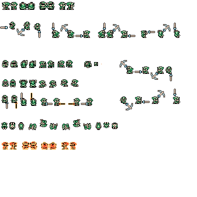

## Reef

The biggest technical challenge was definately managing the link's attack function. This feature is so full in incricuite details that make the hit feel satisfying. This is partly due to the three windows of hit that the player goes through. Starting with the initial slash, followed by link holding his sword out and finishing with the max charge that spins if you let go of the key. In the game there are very specific time windows that change what happens when you let go of the key or keep the key held down. These were pretty confusing to track. In the end, we had to make multiple timers to keep track of different things within the hit function.

The biggest asset contribution i have is the player sprite and animation. I broke down each of links frames, frame by frame by taking screenshots of link in an emulator running at 1 frame per second to make sure that each animation frame was accounted for to ensure that link looked like he was smooth in his transitions. However, i found that this was an ongoing thing because as things and new features would be implemented, i would discover new sprite needs and so this document was constantly updated.

The largest code feature that i wrote was the players movement/shield/jump/attack/fall. these scripts allow link to do his actions in the game such as combat, and room navigation. After the re-factor, these were split into different CS files and were made to talk to each other so they all knew which state link was in. All these are under [the Player script](../Assets/Scripts/Player/Player.cs).
